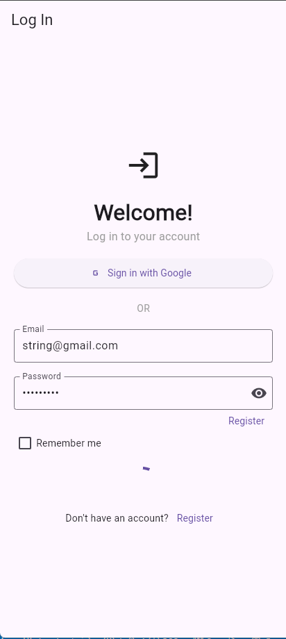
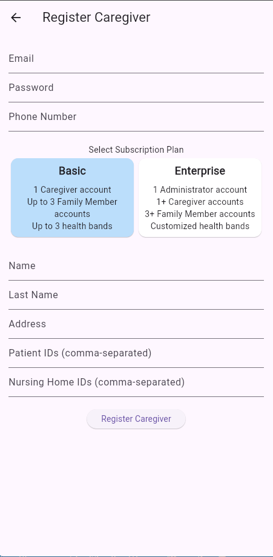

# miam_flutter

A new Flutter project.

aplicación móvil como parte de un proyecto académico relacionado con IoT, cuyo objetivo principal era facilitar el cuidado de adultos mayores. La aplicación permite:
- Registrar cuidadores asignados a pacientes mayores.
- Monitorear en tiempo real signos vitales y temperatura de los pacientes.
- Visualizar un historial detallado de los datos recopilados, facilitando el seguimiento y la toma de decisiones.

pantalla de inicio

pantalla de registro
