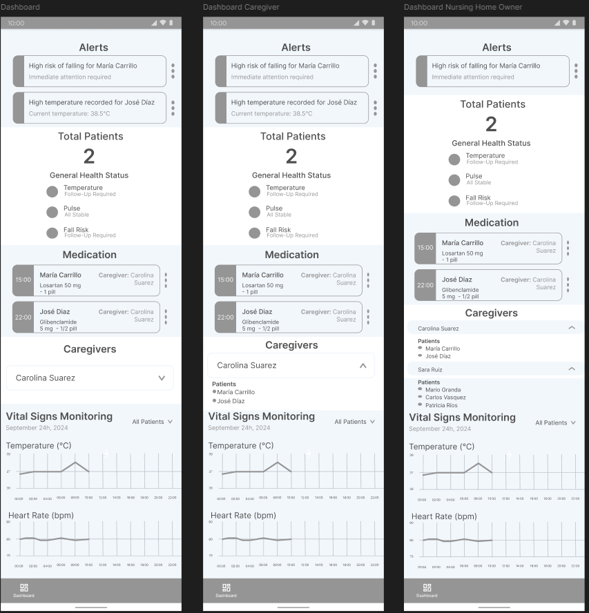
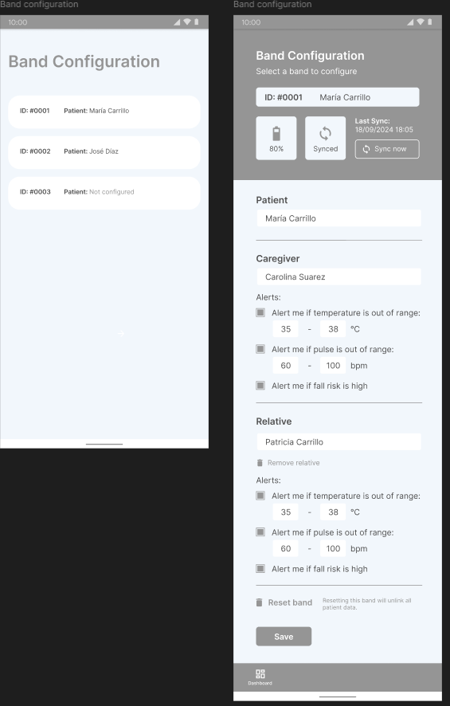

# miam_flutter

A new Flutter project.

## Descripción

Aplicación móvil desarrollada como parte de un proyecto académico relacionado con IoT, cuyo objetivo principal es facilitar el cuidado de adultos mayores. La aplicación permite:

- Registrar cuidadores asignados a pacientes mayores.
- Monitorear en tiempo real signos vitales y temperatura de los pacientes.
- Visualizar un historial detallado de los datos recopilados, facilitando el seguimiento y la toma de decisiones.

## Funcionalidades

- **Registro de cuidadores**: Permite asignar cuidadores a pacientes mayores.
- **Monitoreo en tiempo real**: Monitorea signos vitales y temperatura de los pacientes en tiempo real.
- **Historial de datos**: Visualiza un historial detallado de los datos recopilados para facilitar el seguimiento y la toma de decisiones.

## Capturas de Pantalla

### Pantalla de Inicio

### Pantalla de Registro

### Pantalla de Monitoreo de Signos Vitales y Temperatura

### Pantalla de Configuración de Pulseras
